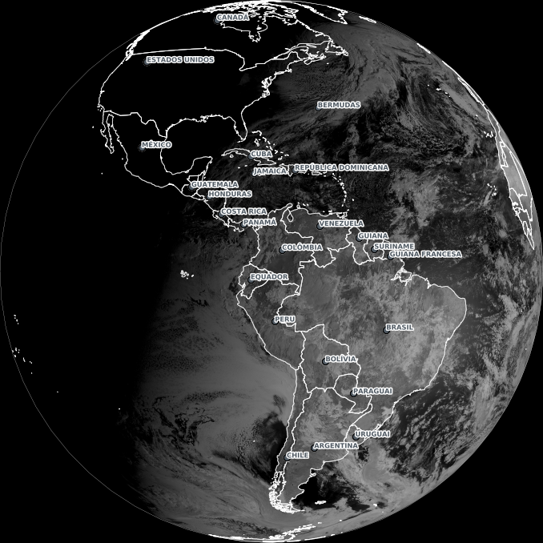
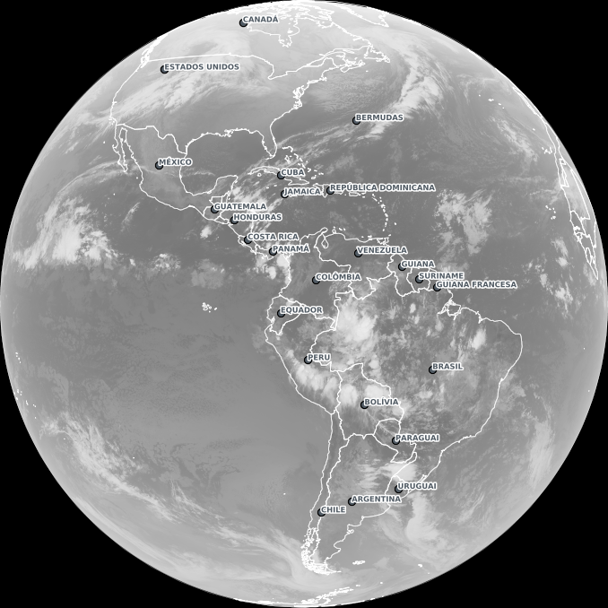
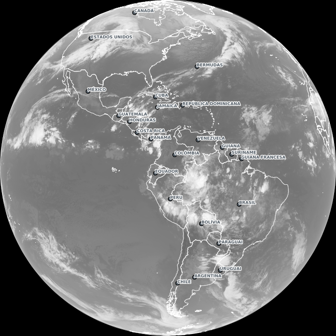

# DSAT-cli
A command-line implementation of the DSAT/INPE tool in Python.
This tool downloads images and products taken by the GOES-16 satellite, processed by National Institute for Space Research ([INPE](www.inpe.br))
and creates animations/GIFs from those images. See an example below.

[DSAT](www.cptec.inpe.br/dsat) is the INPE's GOES-16 satellite image viewer application. Visit www.cptec.inpe.br/dsat 🌎🛰️

**Note:** DSAT-cli implementation is inspired by https://github.com/colinmcintosh/SLIDER-cli and [@colinmcintosh](https://github.com/colinmcintosh).

### Motivation

This tool is meant to replicate most of the features of DSAT and includes some additional
flexibility in configuration options. The goal of this utility is to resolve some common issues with
the DSAT web interface, specifically:

- Missing tiles / tiles not being rendered on animation export
- Slow to generate animations
- Web browser may crash for complex animations
- Limited options for features like time-step and speed

## Products

Ch01 | Ch02 | Ch03 | Ch04
--- | --- | --- |---
 |  |  | 

Ch05 | Ch06 | Ch07 | Ch08
--- | --- | --- |---
 |  |  | 

Ch09 | Ch10 | Ch11 | Ch12
--- | --- | --- |---
 |  |  | 

Ch13 | Ch14 | Ch15 | Ch16
--- | --- | --- |---
 |  |  | 

Ch08 (WVCOLOR35) | Ch09 (WVCOLOR35) | Ch10 (WVCOLOR35)
--- | --- | ---
 |  | 

Ch13 (IR4AVHRR6) | Ch13 (DSA)
--- | ---
 | 

Airmass | Ash | Cloud Phase (Eumetsat) | Cloud Phase (JMA)
--- | --- | --- |---
 |  |  | 

Convective Storm | Day Snow Fog | Differential WV | Dust
--- | --- | --- |---
 |  |  | 

## Usage
```
dsat-cli.py --help
usage: dsat-cli [-h] --product PRODUCT --date DATE [-i I] [--time-step TIME] --level {2,3,4,5,6,7}
                [--tiles-extent xmin ymin xmax xmax] [--speed SPEED] --output OUTPUT [--verbose] [--version]

DSAT-Cli. Copyright (C) 2021-2022 INPE.

optional arguments:
  -h, --help            show this help message and exit
  --product PRODUCT, -p PRODUCT
                        Product that will be retrieved
  --date DATE, -d DATE  Desired image datetime. Format: YYYYMMDDhhmm
  -i I                  Number of images that will be requested from the given date as start.
  --time-step TIME, -t TIME
                        Interval of image capture times in minutes. (default 10)
  --level {2,3,4,5,6,7}, -l {2,3,4,5,6,7}
                        Level (zoom) that will be retrieved
  --tiles-extent xmin ymin xmax xmax
                        Optional tiles extent
  --speed SPEED         Frame rate, i.e. time between two consecutive frames. Default: 0.5 (in seconds)
  --output OUTPUT, -o OUTPUT
                        Output filename to save resut
  --verbose             Increase output verbosity
  --version, -v         show program's version number and exit
```

## Example Usage

```bash
# Donwload single image (2021/11/12 - 12:00 UTC) Full-disk at level 2
dsat-cli.py -p true_color_ch13_dsa -d 202111121200 -i 1 -l 2 -o full-disk.png
```


```bash
# Donwload animation (Start 2021/11/12 - 12:00 UTC + 17 images, step 10 min) Brazil at level 4
dsat-cli.py -p true_color_ch13_dsa -d 202111121200 -i 18 -l 4 --tiles-extent 5 4 9 8 -o brazil-l4-anim.gif
```


```bash
# Donwload animation (Start 2021/11/12 - 12:00 UTC + 17 images, step 10 min) Fortaleza - CE at level 6
dsat-cli.py -p true_color_ch13_dsa -d 202111121200 -i 18 -l 6 --tiles-extent 34 22 35 23 -o fortaleza-l4-anim.gif
```


```bash
# Donwload animation (Start 2021/11/12 - 12:00 UTC + 17 images, step 10 min) Brasília - DF at level 7
dsat-cli.py -p ch02 -d 202111091200 -i 18 -l 7 --tiles-extent 63 55 63 55 -o brasilia-l7-anim.gif
```


## License
Copyright (C) 2020-2021 INPE.

DSAT-Cli is free software; you can redistribute it and/or modify it
under the terms of the MIT License; see LICENSE file for more details.
